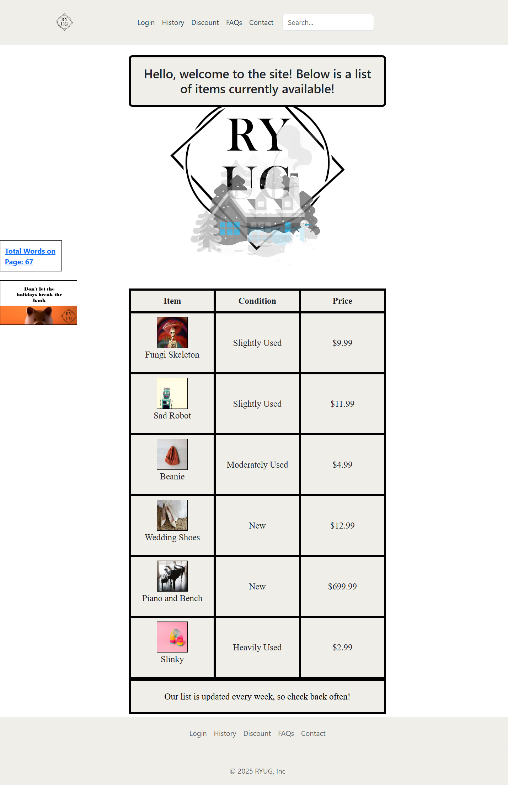
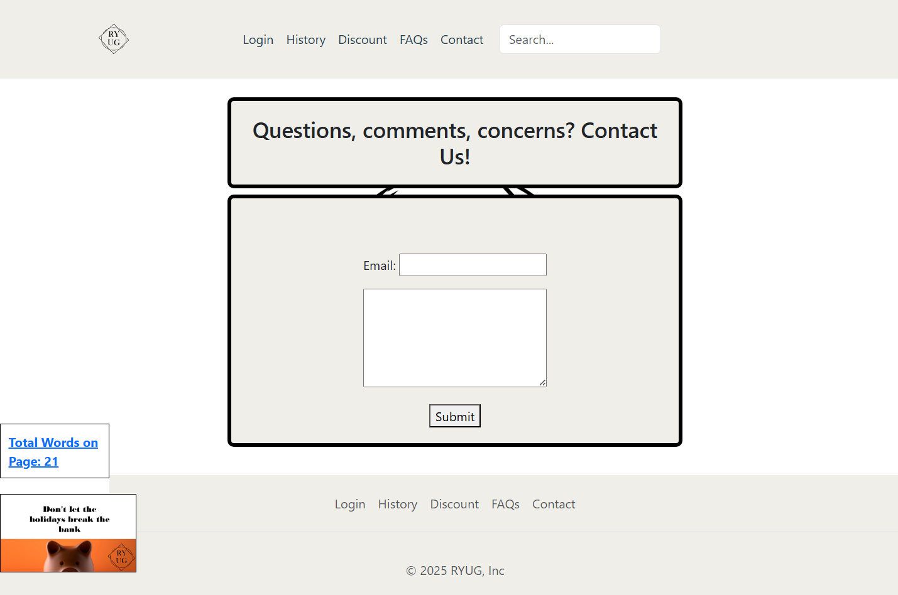
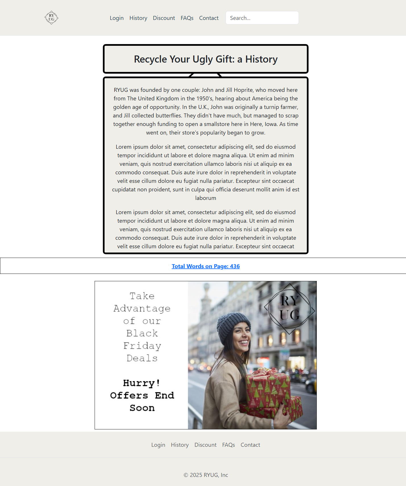
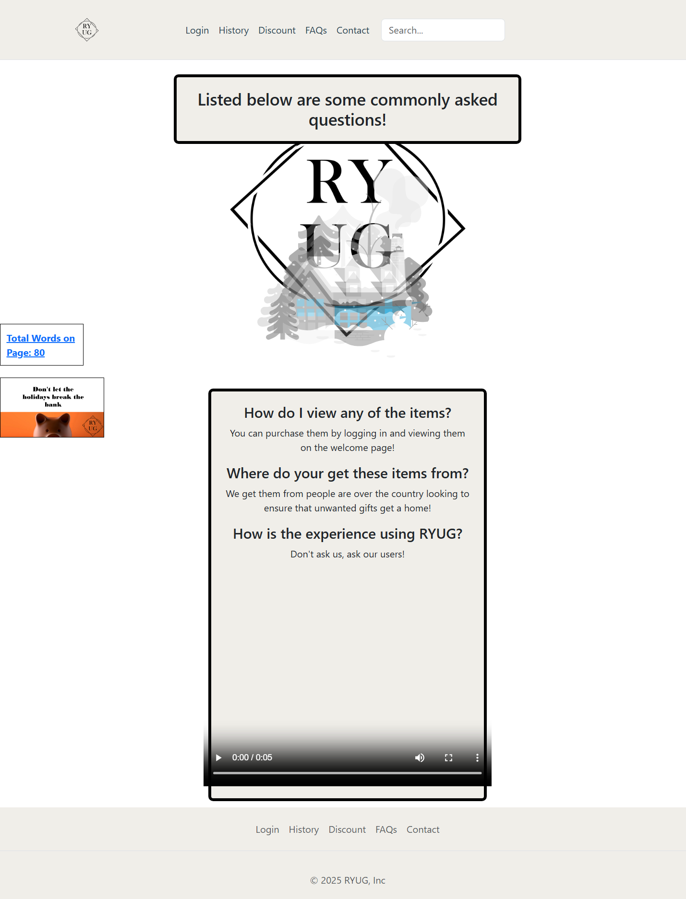
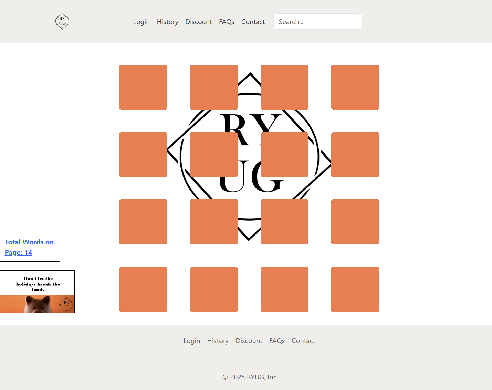

# Web_Programming_I_Final
Final project submission for web programming I
This uses a tutorial to make a logo for one image (tutorial for logo making is Logos by Nick: https://www.youtube.com/watch?v=qCaTXvJE4X8), and uses ASMR's programming tutorial for a tile matching game with modifications (source here: https://www.youtube.com/watch?v=R51QkU6AXRE). The headers and formats are from CDN's to Bootstrap.

The purpose of this project was to display knowledge of HTML/CSS/JS that would be associated with making a website.
There are 6 HTML pages: login, contact, discount, welcome, faq, and history. Each page has a fake ad and a word count of the total amount of words on the page above it, and each ad redirects to the login page.  The ads are made with a combination of images and icons from microsoft office and GIMP. 
The search bar redirects to pages based on the usage of simple words (such as "login").
We were also tasked with inserting animations done with CSS. Two animations were required-one is on the FAQ page, and the other on the login page. 

Login requires a sign-in that submits a form and then redirects to the welcome pages. Wrong username/password instead displays an alert asking for the right credentials.

  
Welcome displays a table of available items, each with a name, condition, and price.

  
Contact displays a form that sends an alert when submitted.

  
History tells a short history of the store-most of the text is the ipsum placeholder. Clicking the container with the text scrolls it, and then clicking again stops it.

  
Faq lists a few questions that a potential customer would have in a table. It includes a generic customer feedback video. The image above the FAQ fades in aand out with another image and satisfies our second animation requirement.

  
Discount includes a tile matching game modified from the above link mentioned at the start of the readme. When two tiles match, it informs a customer that they got a discount of a particular percentage.

  

